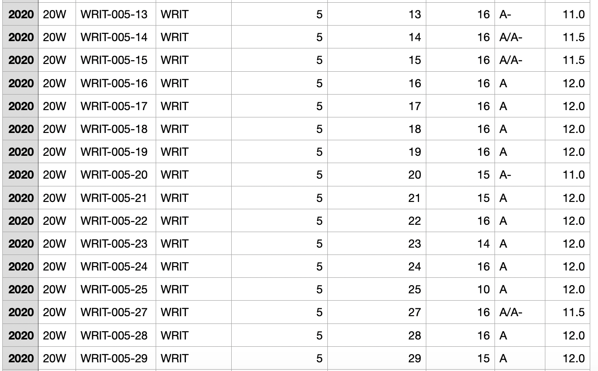

# Dartmouth Trends
A new tool to understand grade distribution and enrollment patterns at Dartmouth College

## Objective 
During course selection time, many Dartmouth students go hunting for the medians of potential classes they are going to take. They hop from page to page on Layup List, D-Planner, or the Registrar’s page, trying to determine if the courses they are thinking of taking will be layups or GPA sinkers. In addition to students, administration and academic departments should also care about these same data points that students search for. With grade inflation becoming more relevant, academic departments need a way to analyze the recent trends in grade distributions for their classes and overall department. In addition, to help inform departments on the capacity and frequency in which to offer courses, they need a way to determine the trends in enrollments of their department and classes. 

## What Dartmouth Trends Offers
Dartmouth Trends will offer an easy way to answer all the above inquiries. Dartmouth Trends will eventually be a website that allows Dartmouth students and administrators to compare the enrollment and grade distributions of classes over the course of a range of terms. Dartmouth Trends also allows for the understanding of more macro trends, as users will also be able to see enrollment and grade distribution patterns of entire academic departments on a year-by-year basis. 

## The Process of Making Dartmouth Trends

### The Data
Every term, Dartmouth posts enrollments/medians for every single course of that term onto a table on a page in the ORC website. Below is an example of the data posted for the 20W Dartmouth term. 

### Scraping the Data
Using Beautiful Soup, I scraped all the data for medians and enrollments for every single course that has been administered from 11S to 20W. To do so, I had a for-loop that visited each page where the medians/enrollments were posted for each term, and scraped all the data from those HTML tables into a Pandas data frame. Afterwards, I exported the data frame into a CSV file. Below is the head of my rawData CSV table. 

 

### Processing the Data

**Splitting Courses** 

In the original data table, courses are given as Dept-CourseNumber-SectionNumber (ex. COSC-010-001). To better process the data, I first split these course tags into department name, course number, and section number. 

**Assigning Quality Points**

On the original site, medians were given in terms of letter grades. I then assigned all medians according to their corresponding quality points (which divided by 3, yields the corresponding grade point value). To account for medians which had two grades (ex. A-/B+), I averaged the quality points of the two grades. 

**Combining Multi-Sectional Courses**

Many courses have multiple sections. For instance, below you can see that in 12W, there were 19 different sections of Writing 5.

Because we are trying to understand trends for specific courses and specific terms, it makes sense to combine these multi-sectional courses. To do this, I averaged the quality points (medians) among all the sections and summed up the enrollment of all sections. Below is the format of the combined sections data table, as well as an example of the Writing 5 courses with combined sections. 

img src = "screenshots/combinedData.png" width = "300">

img src = "screenshots/afterCombine.png" width = "300">

### Writing Functions to Process User Queries 

## Future Goals
For the next step of the project, I hope to be able to use React (for front-end) and Flask (for back-end) to a set-up a web-application that is able to functionally process user queries. I'm currently looking to have that booted up by mid-June, 2020. 

